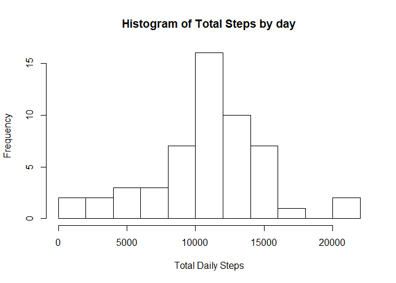
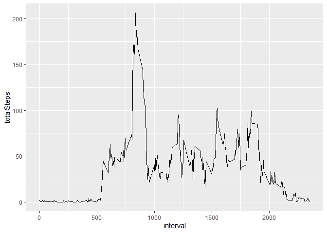
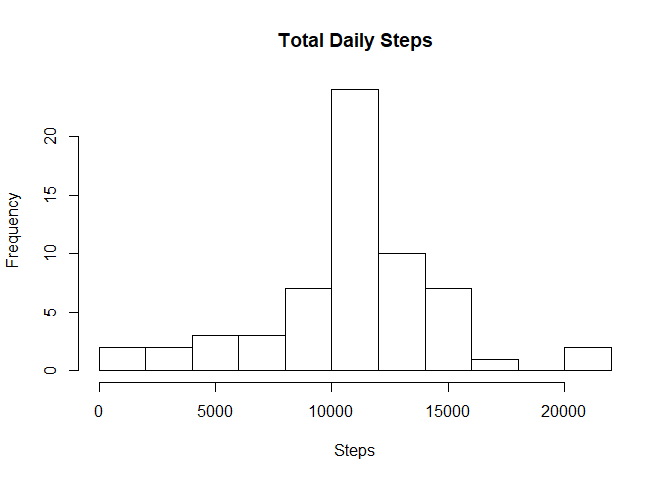
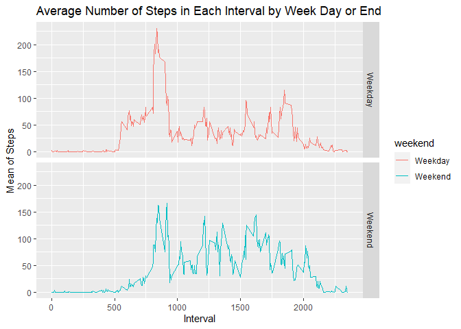

## Loading and preprocessing the data

```r
unzip(zipfile="activity.zip")
data <- read.csv("activity.csv")
```


## What is mean total number of steps taken per day?

```r
library(magrittr)
library(dplyr)
```

```
## 
## Attaching package: 'dplyr'
```

```
## The following objects are masked from 'package:stats':
## 
##     filter, lag
```

```
## The following objects are masked from 'package:base':
## 
##     intersect, setdiff, setequal, union
```

```r
databydate <- data %>% select(date, steps) %>% group_by(date) %>% summarize(totalSteps= sum(steps)) %>%na.omit()
hist(databydate$totalSteps, xlab = "Total Daily Steps",main="Histogram of Total Steps by day", breaks = 10)
```

<!-- -->


```r
mean(databydate$totalSteps)
```

```
## [1] 10766.19
```

```r
median(databydate$totalSteps)
```

```
## [1] 10765
```

## What is the average daily activity pattern?


```r
library(ggplot2)
databyinterval <- data%>% select(interval, steps) %>% na.omit() %>% group_by(interval) %>% summarize(totalSteps= mean(steps)) 
ggplot(databyinterval, aes(x=interval, y=totalSteps))+ geom_line()
```

<!-- -->

Which 5-minute interval contains the maximum number of steps on average across all of the days?

```r
databyinterval[which.max(databyinterval$totalSteps),]
```

```
## # A tibble: 1 x 2
##   interval totalSteps
##      <int>      <dbl>
## 1      835       206.
```

## Imputing missing values

```r
missing <- is.na(data$steps)
table(missing)
```

```
## missing
## FALSE  TRUE 
## 15264  2304
```

To fill in the missing values, I imputed the missing data with the mean of the interval


```r
library(magrittr)
library(dplyr)
impute <- function(x) replace(x, is.na(x), mean(x, na.rm = TRUE))
imputeddata <- data%>% group_by(interval) %>% mutate(steps= impute(steps))
head(imputeddata)
```

```
## # A tibble: 6 x 3
## # Groups:   interval [6]
##    steps date       interval
##    <dbl> <fct>         <int>
## 1 1.72   2012-10-01        0
## 2 0.340  2012-10-01        5
## 3 0.132  2012-10-01       10
## 4 0.151  2012-10-01       15
## 5 0.0755 2012-10-01       20
## 6 2.09   2012-10-01       25
```


```r
aggregateDataByDay <- aggregate(imputeddata$steps, by=list(imputeddata$date), sum)
names(aggregateDataByDay)[1] ="date"
names(aggregateDataByDay)[2] ="totalsteps"
hist(aggregateDataByDay$totalsteps, xlab = "Steps", ylab = "Frequency", main = "Total Daily Steps", breaks = 10)
```

<!-- -->
Imputing the data using the mean increased the median and left the mean where it was. Using this method would also decrease the standard deviation and any metric related to variation. 


```r
summary(aggregateDataByDay)
```

```
##          date      totalsteps   
##  2012-10-01: 1   Min.   :   41  
##  2012-10-02: 1   1st Qu.: 9819  
##  2012-10-03: 1   Median :10766  
##  2012-10-04: 1   Mean   :10766  
##  2012-10-05: 1   3rd Qu.:12811  
##  2012-10-06: 1   Max.   :21194  
##  (Other)   :55
```


```r
mean_0 <- mean(databydate$totalSteps, na.rm = TRUE)
mean_1 <- mean(aggregateDataByDay$totalsteps)
mean_0
```

```
## [1] 10766.19
```

```r
mean_1
```

```
## [1] 10766.19
```

## Are there differences in activity patterns between weekdays and weekends?
As can be seen from the graphs below, the weekdays spike in the morning and are greater than weekend numbers at that time. The rest of the day on the weekdays is less than the weekend, possibly due to desk work. 

```r
library(ggplot2)
imputeddata$date <- as.Date(imputeddata$date)
imputeddata$weekday <- weekdays(imputeddata$date)
imputeddata$weekend <- ifelse(imputeddata$weekday=="Saturday" | imputeddata$weekday=="Sunday", "Weekend", "Weekday" )
WeekEndData <- aggregate(imputeddata$steps , by= list(imputeddata$weekend, imputeddata$interval), na.omit(mean))
names(WeekEndData) <- c("weekend", "interval", "steps")
ggplot(WeekEndData, aes(x=interval, y=steps, color=weekend)) + geom_line() + facet_grid(weekend ~.) + xlab("Interval") + ylab("Mean of Steps") +
    ggtitle("Average Number of Steps in Each Interval by Week Day or End")
```

<!-- -->
